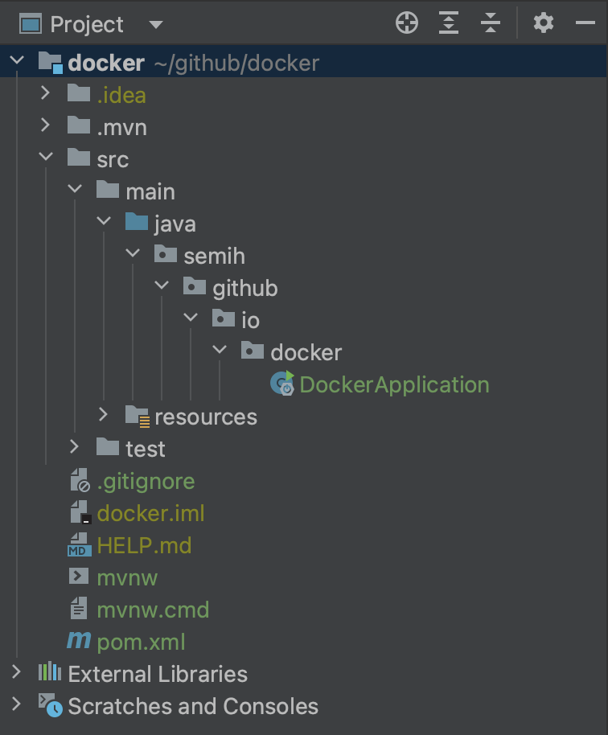
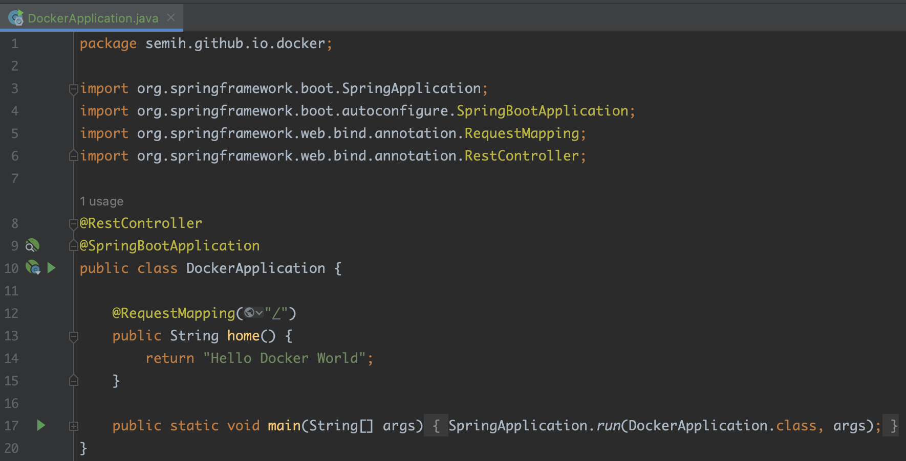
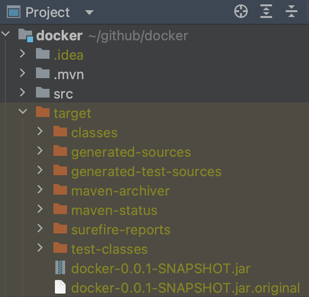
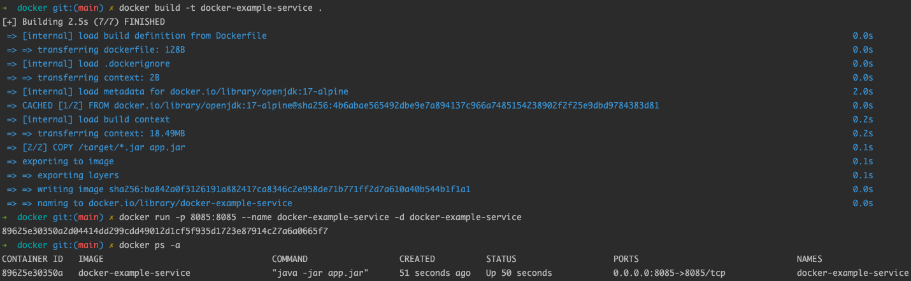

In this post, we will use Docker to create an image of a Spring Boot application and run it in a container. Let's generate a Spring Boot application.

**1. create a Spring Boot application**
I created the Spring Boot application with a standard maven plugin that includes Spring Web dependency.


**2. create a rest controller**
Basically, I added a rest controller to prove that the application is working.


**3. add Dockerfile to the project**
I added a file called Dockerfile to the root directory with no extension.
```bash
FROM openjdk:17-alpine
COPY /target/*.jar app.jar
ENTRYPOINT ["java","-jar","app.jar"]
```

**4. add maven plugin as a plugin**
At this point, I need a maven plugin. Check the pom.xml file or add it.
```xml
<build>
    <plugins>
        <plugin>
            <groupId>org.springframework.boot</groupId>
            <artifactId>spring-boot-maven-plugin</artifactId>
        </plugin>
    </plugins>
</build>
```

**5. define a bitbucket-pipelines(optional)**
This topic will also be covered. Not for the moment though.

**6. build the project**
If the maven plugin is available for you to use in the terminal, run the "mvn install" command to provide your project built. You will see that the target package and jar files in it are created.


**7. execute java jar command**
```bash
java -jar target/docker-0.0.1-SNAPSHOT.jar
```
Eventually the project is up and running, and when I send a request from the browser, I expect to see "Hello World Docker" on the screen. 

So far, our application has worked normally. Not in any docker container.I guess everything we've done so far is clear, understandable, and the way we always do.

The commands we will write from now on will make the project run on a docker container.

You can use the commands below to check containers and images running on Docker.
```bash
docker ps -a
docker images
docker rmi a67aecce36a5
```
**8. run docker commands for containerization**

```bash
docker build -t docker-example-service .
docker run -p 8085:8085 --name docker-example-service -d docker-example-service

# to communicate with the remote database
docker run -p 8085:8085 -e PORT=8085 -e POSTGRESQL_HOST=192.168.X.X -e POSTGRESQL_PORT=5432 -e POSTGRESQL_DB_NAME=exampleDb -e POSTGRESQL_USER=postgres -e POSTGRESQL_PASSWORD=postgres --name docker-example-service -d docker-example-service

docker ps -a
docker logs -f 904957ee3ae2
```
:ok_hand: And Spring Boot application is running on the Docker container as expected. :blush: :tada: :clap:


Hope the information in this post is useful and enough for you. Please contact me if you have any questions or comments. :wave: